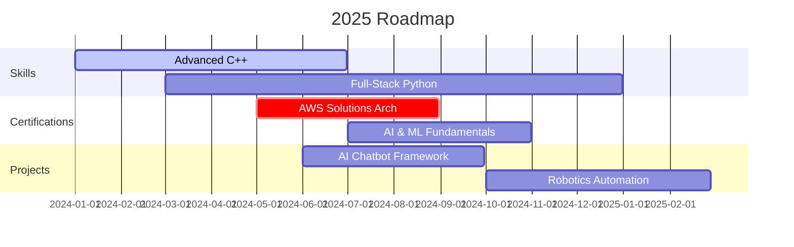

Here’s a **next-level, elite** `README.md` template for **Abdul Wahid Chohan**, combining cutting-edge visuals, live metrics, animated headers, Mermaid diagrams, WakaTime stats, dynamic changelogs, and more to deliver an unforgettable first impression.

---

## Summary  
Top 2025 GitHub profiles leverage **animated headers** for instant engagement, **live metrics** for credibility, **Mermaid diagrams** for dynamic roadmaps, **WakaTime** and **GitHub Stats** cards for productivity proof, and **dynamic changelogs** to showcase real-time activity citeturn0search11turn0search19turn0search20. This template merges all these elements into one seamless, branded experience.

---

## Key Features

### 💫 Animated Header  
A custom banner sets the tone and reinforces branding, using `capsule-render` or a generated graphic citeturn0search11.

### 📊 Live Metrics & Coding Stats  
- **GitHub Stats** via `github-readme-stats` for contribution numbers and language breakdown citeturn0search6.  
- **WakaTime Weekly Metrics** to display your actual coding hours and language usage citeturn0search2.

### 📈 Dynamic Changelog  
Embed a live changelog with GitClear’s generator to highlight your latest commits and activities citeturn0search20.

### 📋 Mermaid Diagrams & Roadmaps  
Use Mermaid syntax for rendered flowcharts, Gantt charts, and more—no external images needed citeturn0search1turn0search5.

### 🛡️ Badges & Contact Links  
Branded shields for skills, certifications, and social links that drive action citeturn0search0turn0search8.

---

## Elite `README.md` Template

> **Note:** Upload your custom banner graphic (`assets/banner.png`) to your repo before using.

```markdown
<!-- Custom Banner -->
<p align="center">
  
</p>

<!-- Navigation -->
<p align="center">
  <a href="#about"><strong>About</strong></a> •
  <a href="#skills"><strong>Skills</strong></a> •
  <a href="#projects"><strong>Projects</strong></a> •
  <a href="#stats"><strong>Stats</strong></a> •
  <a href="#activity"><strong>Activity</strong></a> •
  <a href="#roadmap"><strong>Roadmap</strong></a> •
  <a href="#contact"><strong>Contact</strong></a>
</p>

---

## 🚀 About Me <a name="about"></a>
I’m **Abdul Wahid Chohan**, a BS Robotics & Intelligent Systems student blending **code**, **design**, and **AI** to build future-forward solutions.

---

## 🛠 Skills & Tools <a name="skills"></a>
<p align="center">
    
    
    
    
    
  
</p>

---

## 📂 Signature Projects <a name="projects"></a>
<div align="center">
  <a href="https://github.com/AbdulWahidChohan/My-Cpp-Projects">
    
  </a>
  <a href="https://github.com/AbdulWahidChohan/Python-Assignments">
    
  </a>
</div>

---

## 📈 GitHub Stats <a name="stats"></a>
<div align="center">
  
  &nbsp;
  
</div>

---

## 📝 Recent Activity <a name="activity"></a>
<!-- Dynamic Changelog via GitClear -->
<p align="center">
  
</p>

---

## 📊 Roadmap & Goals <a name="roadmap"></a>


---

## ⏱️ Weekly Coding Stats
```markdown
<!-- WakaTime Stats -->

```

---

## 🌐 Connect with Me <a name="contact"></a>
<p align="center">
  <a href="https://portfolio-website-personal-abdul-wahid-chohan.vercel.app/">
    
  </a>
  <a href="mailto:aw4532350@gmail.com">
    
  </a>
  <a href="https://www.linkedin.com/in/abdul-wahid-chohan/">
    
  </a>
</p>

---

<p align="center">
  
</p>
```

---
