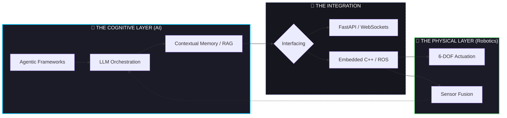

 

 

---

## 🧬 Identity Core

<table width="100%">
<tr>
<td width="55%" valign="top">

**Location:** Karachi, Pakistan 🇵🇰  
**Phone:** +92 306 1288989  
**Website:** [abdulwahidchohan.vercel.app](https://abdulwahidchohan.vercel.app/)  
**Focus:** Robotics · Agentic AI · Backend Engineering · Embedded Systems

### 🎓 Education

| Degree | Institution | Expected |
|---|---|---|
| BS Robotics & Intelligent Systems | Bahria University, Karachi | 2028 |
| BS Computer Science | University of the People (Online) | 2028 |
| Comprehensive Diploma — AI, Web 3.0, Cloud, DevOps | GIAIC | 2028 |
| Intermediate (Pre-Engineering) | Bahria College Karsaz, Karachi | Completed |

### 🏆 Awards & Honors

- 🌟 **Rising Star Award** — Governor's Initiative for AI & Web 3.0 (GIAIC), 2024
- 💻 **Mr. Computer Expert** — Bahria College Karsaz, 2024
- 🎖️ **College Prefect** — Bahria College Karsaz, 2023–2024

</td>
<td width="45%" valign="top">

</td>
</tr>
</table>

---

## 🧠 Professional Profile

I am an **innovative, impact-driven technology professional** with a multidisciplinary foundation across **Robotics & Intelligent Systems**, **Computer Science**, **Artificial Intelligence**, **Embedded Systems**, **Full-Stack Development**, **Cloud Technologies**, and **Agentic AI**.

What makes my profile distinctive is the ability to **bridge hardware engineering with intelligent software systems** — building both the *brains* and the *body* of autonomous technology. From fine-tuned multi-agent AI platforms to 6-DOF robotic arms controlled via Bluetooth, my work spans the full depth of the intelligent systems stack.

> **📂 52 GitHub repositories** spanning AI, robotics, backend engineering, security utilities, full-stack web apps, and automation workflows.

### ⚙️ Engineering Philosophy

<table width="100%">
<tr>
<td width="50%">

**Operating Principles**
- Systems over scripts
- Automation over repetitive effort
- Depth over surface-level hype
- Modular, API-first architecture
- Secure-by-design engineering

</td>
<td width="50%">

**Development Approach**
- API-first design & modular backend structure
- Agent-based orchestration thinking
- Component-driven frontend architecture
- Asynchronous, deployment-aware workflows
- Open-source experimentation & iterative prototyping

</td>
</tr>
</table>

---

## ⚡ System Integration: The Brains & The Body

As a Robotics and AI engineer, I specialize in combining high-level cognitive intelligence with low-level hardware control.

```mermaid
graph LR
    subgraph Brains ["🧠 THE COGNITIVE LAYER (AI)"]
        A[Agentic Frameworks] --> B[LLM Orchestration]
        B --> C[Contextual Memory / RAG]
    end
    
    subgraph Bridge ["🔄 THE INTEGRATION"]
        C --> D{Interfacing}
        D --> E[FastAPI / WebSockets]
        D --> F[Embedded C++ / ROS]
    end
    
    subgraph Body ["🦾 THE PHYSICAL LAYER (Robotics)"]
        F --> G[6-DOF Actuation]
        F --> H[Sensor Fusion]
        H -.-> B
    end

    style Brains fill:#1a1b27,stroke:#00C9FF,stroke-width:2px,color:#fff
    style Body fill:#1a1b27,stroke:#92FE9D,stroke-width:2px,color:#fff
    style Bridge fill:#16161e,stroke:#7aa2f7,stroke-dasharray: 5 5,color:#fff
```

---

## 🛠️ Technical War Chest

### Languages

### AI, Machine Learning & Agentic Systems

### Backend & Databases

### Frontend & UI

### Cloud, DevOps & Security

### Robotics & Embedded Systems

---

## 🚀 Selected Project Portfolio

### 🤖 Agentic AI & Intelligent Systems

| Project | Domain | Stack | Status | Description |
|---|---|---|---|---|
| **Pixora** | Multi-Agent Automation | Python, LLM APIs | `STABLE` | Multi-agent AI platform for workflow automation & intelligent task delegation |
| **FreelanceX** | Agent Marketplace | Python, Multi-Agent Architecture | `BETA` | AI-powered workflow automation & intelligent task routing for freelancers |
| **AI Employee Vault** | AI Memory Systems | Python, FastAPI, PostgreSQL | `ACTIVE` | Structured AI system for employee memory, contextual retention & knowledge storage |
| **AI Edu Coach** | Educational AI | Python, LLM, RAG | `DEV` | Generative AI platform for personalized educational coaching & context-aware learning |
| **RAG-Enabled AI Systems** | Knowledge Intelligence | Qdrant, Embeddings, FastAPI | `RESEARCH` | Vector retrieval + generative responses for contextual knowledge access |
| **Voice-Enabled AI** | Conversational AI | pyttsx3, Speech Recognition | `EXPERIMENTAL` | Speech-to-text & text-to-speech exploration for AI interaction systems |

### 🦾 Robotics & Embedded Systems

| Project | Domain | Stack | Status | Description |
|---|---|---|---|---|
| **6-DOF Robotic Arm** | Robotics / Embedded Control | Arduino, C++, Bluetooth | `V.2.0` | Articulated 6-degree-of-freedom robotic arm with Bluetooth wireless control |
| **Obstacle Avoiding Robot** | Autonomous Robotics | Arduino, Ultrasonic Sensors | `STABLE` | Autonomous robot with real-time sensor-based obstacle detection & avoidance |
| **Soccer Robot** | Mobile Robotics | Arduino, Sensor Integration | `V.1.0` | Competitive robotics prototype with responsive embedded logic & real-time control |
| **Sumo Robot** | Robotics Competition | Arduino, Embedded Systems | `ACTIVE` | Autonomous strategy robot for competitive sumo-style engagement |

### 🌐 Full-Stack & Backend Engineering

| Project | Domain | Stack | Status | Description |
|---|---|---|---|---|
| **Portfolio Website** | Personal Branding | Next.js, Radix UI, Framer | `LIVE` | Personal portfolio with polished animation, accessibility & clean UI architecture |
| **Backend API Systems** | Backend Engineering | FastAPI, PostgreSQL, Pydantic | `PROD` | Modular API services with async programming & API-first design |
| **Auth & Security Patterns** | Security / Identity | JWT, Better Auth, bcrypt | `SECURED` | Token-based auth, credential protection, rate limiting & backend security |
| **Dockerized App Workflows** | DevOps / Deployment | Docker, Docker Compose | `STABLE` | Containerized workflows for deployment consistency & scalable packaging |
| **Todo App** | Productivity | Next.js, FastAPI, PostgreSQL | `LIVE` | Full-stack task management app combining modern React frontend with async Python backend |

### 🔐 Security & Utilities

| Project | Domain | Stack | Description |
|---|---|---|---|
| **secure_data_encryption** | Security / Python | Python, Cryptographic Logic | Secure data encryption module for protecting sensitive information |
| **AWM-ATM** | CLI Application | TypeScript | ATM-style CLI app demonstrating logical flow, input handling & interactive software behavior |
| **awm-currency-convertor** | Utility | TypeScript | Currency conversion tool focused on practical utility logic |
| **Web Scraping Suite** | Automation | BeautifulSoup, Scrapy, Selenium, aiohttp | Structured data extraction, automation tasks & web-based information processing |

---

## 💼 Leadership & Roles

<table width="100%">
<tr>
<td width="50%" valign="top">

**🏢 CTO — MT International**
- Led organizational technology strategy, digital planning & technical execution
- Aligned technical initiatives with broader business objectives
- Directed improvement of digital systems & infrastructure

**🚀 VP — Bahria Space & Robotics Association (BSRA)**
- Led society operations, technical events & robotics initiatives
- Promoted innovation, teamwork & practical engineering learning
- Built a stronger student technical culture through workshops & project-based participation

</td>
<td width="50%" valign="top">

**🤖 Robotics & AI Ambassador**
- Promoted robotics, automation & AI initiatives across academic communities
- Supported outreach and awareness for emerging technologies

**🎓 Student Representative — Bahria University**
- Primary liaison between students & university administration
- Represented student concerns & coordinated institutional communication

**💻 Independent Developer (Open Source)**
- 52 active repositories across AI, robotics, backend, security & web engineering
- Applied RAG architectures, vector databases, auth systems & modular engineering patterns

</td>
</tr>
</table>

---

## 📜 Certifications & Specializations

<b>🧠 Generative AI & Machine Learning</b>

 

- **Build Your First Agent with Agent Development Kit (ADK)** — Google Cloud (2026)
- **Google AI Essentials** — Google / Coursera (2024)
- **Generative AI Fundamentals & Large Language Models** — Google Cloud / Coursera (2024)
- **Encoder-Decoder Architecture & Image Generation** — Google Cloud / Coursera (2024)
- **Mining Quality Prediction Using Machine & Deep Learning** — Coursera Project Network (2022)
- **Certified Cloud Applied Generative AI Engineer** — GIAIC
- **AI Fundamentals** — DataCamp

<b>📊 Data Science & Analytics</b>

 

- **The Data Scientist's Toolbox** — Johns Hopkins University / Coursera (2022)
- **What is Data Science?** — IBM / Coursera (2022)
- **Data Analytics and Business Intelligence** — DigiSkills (2022)
- **Mastering Data Analysis with Pandas & R Programming** — Coursera Project Network (2022)
- **Prepare, Clean, Transform, and Load Data using Power BI** — Coursera Project Network (2022)

<b>💻 Programming, Cloud & Professional Development</b>

 

- **TypeScript Variables and Data Types** — Coursera Project Network (2024)
- **Use AI Builder and Power Apps to Process Invoice Data** — Coursera Project Network (2023)
- **Google Soft Skills Program** — Google / PAFLA (2024)
- **Freelancing** — DigiSkills (2022)

> 🗂️ *30+ total credentials earned. Selected highlights shown above.*

---

## 🌍 Technical Project Domains

### 🤖 Autonomous Intelligence
`Agentic AI Systems` • `LLM Orchestration` • `Retrieval-Augmented Generation (RAG)` • `Contextual Memory Systems` • `Educational AI`

### 🦾 Robotics Engineering
`Autonomous Robotics` • `Embedded Systems Control` • `6-DOF Kinematics` • `Sensor Fusion` • `Real-Time Logic`

### 🌐 System Architecture
`Full-Stack Engineering` • `Backend API Design` • `Secure Auth Patterns` • `Scalable Cloud Workflows` • `E-Commerce Systems`

### 🛠️ Data & Automation
`Web Scraping & ETL` • `Document Processing` • `Developer Utilities` • `CLI Tooling` • `Open-Source Experimentation`

---

## 📈 Activity & Contribution Graph

---

 

### 📡 Let's Connect

 

*"Build the intelligence. Engineer the autonomy. Own the system."*

 

