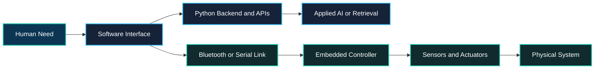

<!--
  Abdul Wahid Chohan | GitHub Profile README
  Brand system: Midnight Navy · Electric Cyan · Signal Teal
  Positioning: Robotics first, Applied AI and Python Backend as supporting strengths
-->

### Robotics & Computer Science Undergraduate

**Building intelligent systems across software and physical automation.**

 

---

## 01 · Engineering Profile

<table>
<tr>
<td width="62%" valign="top">

I am pursuing a **BS in Robotics & Intelligent Systems** at Bahria University Karachi Campus and a **BS in Computer Science** at the University of the People.

My work connects the physical layer of intelligent systems, including sensors, actuators, embedded controllers, circuits, and robotic mechanisms, with the software layer, including Python, APIs, databases, retrieval systems, and applied artificial intelligence.

I am focused on becoming a stronger engineer through **measured prototypes, reproducible software, honest documentation, and fair attribution**.

</td>
<td width="38%" valign="top">

### Verified Highlights

- **Industrial Mechatronics Intern** at Faraz Industries
- **Vice President** of BSRA
- **87/120 credits** in BS Computer Science
- **3.72/4.00 CGPA** at UoPeople
- **Dean's List**, Term 4, 2025–2026
- **1st Prize**, PROCOM 2026 Speed Soldering

</td>
</tr>
</table>

---

## 02 · The Systems I Build

```mermaid
flowchart LR
    A[Human Need] --> B[Software Interface]
    B --> C[Python Backend and APIs]
    C --> D[Applied AI or Retrieval]
    B --> E[Bluetooth or Serial Link]
    E --> F[Embedded Controller]
    F --> G[Sensors and Actuators]
    G --> H[Physical System]

    classDef input fill:#0B3552,color:#fff,stroke:#14B8A6,stroke-width:2px;
    classDef software fill:#162238,color:#fff,stroke:#38BDF8,stroke-width:2px;
    classDef hardware fill:#102A2D,color:#fff,stroke:#2DD4BF,stroke-width:2px;
    class A input;
    class B,C,D software;
    class E,F,G,H hardware;
```

<table>
<tr>
<td width="50%" valign="top">

### Physical Systems

- Embedded robotics and Arduino prototyping
- Sensors, actuators, and servo control
- Control-system fundamentals
- Electronics and circuit simulation
- CAD and engineering documentation
- Industrial manufacturing exposure

</td>
<td width="50%" valign="top">

### Intelligent Software

- Python backend development with FastAPI
- Applied AI and LLM-integrated applications
- Retrieval-augmented generation concepts
- PostgreSQL and vector retrieval
- TypeScript, React, and Next.js
- Docker-based development workflows

</td>
</tr>
</table>

---

## 03 · Featured Engineering Work

<table>
<tr>
<td width="50%" valign="top">

### 🔧 [MechaFix AI](https://github.com/abdulwahidchohan/MechaFix_AI)

**AI-assisted electronics and mechatronics troubleshooting**

Combines text and image input, a curated electronics knowledge base, Gemini integration, and Firestore-backed diagnostic history.

`Deployed Preview` `Active Development`

**Evidence:** source code · project status · design notes · knowledge base

</td>
<td width="50%" valign="top">

### 🦾 6-DOF Robotic Arm

**Bluetooth-controlled articulated robotic-arm prototype**

Built around Arduino, embedded C++, HC-05 communication, and coordinated multi-servo control for pick-and-place-style movement.

`Functional Prototype` `Documentation In Progress`

**Next proof:** repository · wiring diagram · measured repeatability · demo

</td>
</tr>
<tr>
<td width="50%" valign="top">

### 🌐 [FreelanceX.ai](https://github.com/abdulwahidchohan/freelancex.ai)

**AI-assisted freelance workflow platform**

Explores onboarding, semantic matching, proposal support, coordinated agents, and voice-agent workflows for Pakistani users.

`Prototype` `Active Development`

**Implementation details:** maintained in the project repository and documentation

</td>
<td width="50%" valign="top">

### ⚙️ [Ultimate System Updater](https://github.com/abdulwahidchohan/Ultimate-System-Updater)

**Cross-platform maintenance and update automation**

PowerShell, Bash, Zsh, and command-line workflows for Windows, Linux, macOS, and Cisco-related maintenance guidance.

`Public Utility` `Iterative Development`

**Evidence:** source scripts · platform instructions · commit history

</td>
</tr>
<tr>
<td width="50%" valign="top">

### 🤖 Autonomous Robotics Prototypes

**Mobile robotics and embedded-control learning**

PID line-following, obstacle-avoiding, soccer-robot, and sumo-robot prototypes using Arduino, sensors, and embedded decision logic.

`Prototype Collection` `Learning Projects`

</td>
<td width="50%" valign="top">

### 📐 [Engineering CAD Portfolio](https://github.com/abdulwahidchohan/bracket-fan-solidworks-cad)

**SolidWorks and engineering documentation**

Academic CAD studies covering component decomposition, modelling concepts, documentation, and contribution-specific team records.

`Academic Work` `Documented Limitations`

</td>
</tr>
</table>

> **Evidence standard:** project labels describe the current documented state. Claims are limited to source code, project records, demonstrations, reports, or verified outcomes.

---

## 04 · Technical Stack

### Robotics & Engineering

### Applied AI & Backend

### Product & Delivery

<b>View supporting tools and technologies</b>

 

- **Embedded:** Arduino Uno, Mega 2560, HC-05, ultrasonic sensors, line sensors, servo control
- **Backend:** REST APIs, Pydantic, SQLite, asynchronous workflows
- **Frontend:** Tailwind CSS, component-based interfaces, responsive development
- **Engineering:** circuit simulation, engineering drawing, design documentation
- **Development:** GitHub, VS Code, Postman, Vercel, Railway

---

## 05 · Experience & Leadership

<table>
<tr>
<td width="50%" valign="top">

### 🏭 Industrial Mechatronics Intern
**Faraz Industries · Six weeks beginning 21 July 2026**

Gained structured exposure to manufacturing, fabrication, CNC, surface treatment, assembly, wiring, sheet metal, and quality functions.

</td>
<td width="50%" valign="top">

### 🚀 Vice President
**Bahria Society of Robotics and Aeronautics**

Supports society operations, robotics activities, technical participation, exhibitions, and collaborative student initiatives.

</td>
</tr>
<tr>
<td width="50%" valign="top">

### 🏢 Former Chief Technology Officer
**MT International · Oct 2025–Aug 2026**

Contributed to technology planning, digital-systems roadmapping, and technical direction during the initiative's active phase.

</td>
<td width="50%" valign="top">

### 🎓 Earlier Leadership

- Class Representative for three semesters
- Former NUST Robotics & AI Ambassador, 2025
- Former BITS Social Media Member and technical contributor
- College Prefect, 2023–2024

</td>
</tr>
</table>

---

## 06 · Education

<table>
<tr>
<td width="50%" valign="top">

### Bahria University Karachi Campus

**BS Robotics & Intelligent Systems**  
July 2024–2028 · CGPA **3.02/4.00**

Current studies include robotic systems and programming, sensors and actuators, linear control systems, and electronic devices and circuits with corresponding laboratories.

</td>
<td width="50%" valign="top">

### University of the People

**BS Computer Science**  
Official enrollment: January 2025  
**87/120 credits · CGPA 3.72/4.00**

Achieved a **4.00/4.00 term GPA** in June 2026 and was named to the **Dean's List** for Term 4 of 2025–2026.

</td>
</tr>
</table>

### Continuing Education

Ongoing learning in applied AI, agentic systems, Python, and modern application development through the **Governor Sindh Initiative, GIAIC, and Panaversity learning ecosystem**. This is continuing education and is not presented as a completed diploma.

---

## 07 · Selected Credentials

<table>
<tr>
<td width="50%" valign="top">

- **ACT AI National AI Training Programme**  
  Final project: 99/100 · Attendance: 96% · Quiz average: 100%
- **Modern Robotics: Robot Motion Planning and Control**  
  Northwestern University · July 2026
- **Introduction to Ethical Hacking Principles**  
  SkillUp · August 2026

</td>
<td width="50%" valign="top">

- **Google AI Essentials** · Google
- **Introduction to Generative AI** · Google Cloud
- **Introduction to Large Language Models** · Google Cloud
- **Introduction to Responsible AI** · Google Cloud
- **Data Analytics and Business Intelligence** · DigiSkills
- **AutoCAD** · DigiSkills

</td>
</tr>
</table>

<b>Credential policy</b>

 

Only completed and verified learning is presented as a credential. Incomplete courses, application statuses, and ongoing programmes are not represented as completed certifications.

---

## 08 · Technical Communication

Through **A.W.M. Technical Studio**, I publish collaborative AutoCAD exercises and academic-technology tutorials. Project communication is written to distinguish individual contribution, team contribution, current status, and documented limitations.

---

## 09 · Engineering Principles

| BUILD | VERIFY | DOCUMENT | IMPROVE |
|:---:|:---:|:---:|:---:|
| Build before branding | Measure before claiming | Credit collaborators fairly | Turn failures into evidence |

---

## 10 · GitHub Activity

Language statistics reflect repository composition and do not represent proficiency rankings.

---

### Open to Relevant Opportunities

**Robotics · Embedded Systems · Applied AI · Python Backend · Industrial Automation**

 

### Build the system. Test the evidence. Improve the result.

